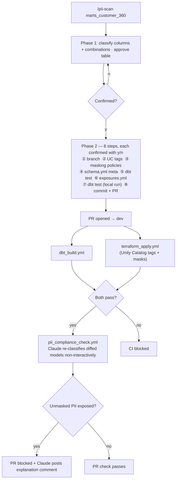
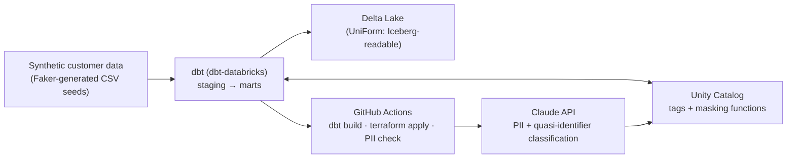

# dbt PII Compliance Pipeline

GDPR requires every organization to know which columns hold personal data and to protect them — but in practice, PII classification is still done by hand, drifts out of date as models change, and tools like Purview or Collibra are expensive and shallow (keyword matching on column names, no judgment on combined re-identification risk).

This project solves that with **Claude as the classification engine for a dbt-on-Databricks pipeline**: a `/pii-scan` command reads a dbt model's columns and sample data, classifies each column against GDPR categories (including quasi-identifier *combinations*, not just single-column keyword matches), tags Unity Catalog accordingly, and a dbt test continuously verifies that nothing PII-tagged reaches a public-facing model unmasked. CI blocks any PR that would ship an unprotected column.

---

## Why This Exists

In a real data platform, new dbt models and columns appear constantly. The traditional approach to PII governance requires someone to:

1. Manually review every new/changed column for personal data
2. Decide whether it's PII on its own, or only risky in combination with other columns
3. Apply masking, keep documentation in sync, and hope nothing slips through before the next audit

This is exactly the kind of judgment-heavy, easy-to-forget work that causes real compliance incidents — not because anyone was careless, but because nothing forces the check at the moment a model changes.

**The goal**: classify PII risk (including multi-column re-identification risk) automatically, enforce it with a dbt test, and block non-compliant changes in CI — with a human reviewing every classification before it's applied.

---

## How It Works

### The `/pii-scan` Command

Invoked inside a Claude Code session:

```
/pii-scan stg_customers
/pii-scan marts_customer_360
```

**Phase 1 — Classify** (no files touched): Claude reads the model's compiled columns plus a bounded data sample, classifies each column (not PII / direct identifier / GDPR Art. 9 special category / quasi-identifier), and checks column **combinations** for re-identification risk — e.g. `postal_code` + `birth_date` + `gender` is low-risk individually but identifying together. The full classification table is shown for approval before Phase 2 begins.

**Phase 2 — Execute**: Each of the 8 steps is shown as a diff with a `y/n` prompt. Nothing is written until confirmed.



### Auto-Generated PR

Claude creates the PR body automatically, summarizing the classification and every file touched — and on the CI side, a second non-interactive pass re-runs the same classification logic against the diff to make sure nothing was approved by mistake and later drifted.

---

## Pipeline Architecture



### Why synthetic data

All sample data is generated with `Faker` — this is a portfolio project, not a real customer dataset, so there is no real PII to protect in the first place. The point is to demonstrate the classification and enforcement *mechanism*, not to handle real personal data.

---

## Tech Stack

| Layer | Technology |
|---|---|
| Compute / platform | Databricks (Free Edition / trial workspace) |
| Governance | Unity Catalog (column tags, masking functions, row filters) |
| Storage format | Delta Lake with UniForm (Iceberg-readable) |
| Transformation | dbt Core + dbt-databricks |
| AI classification (interactive) | Claude Code (`/pii-scan` custom command) — no separate API billing |
| AI classification (CI) | Anthropic API (Python SDK) — only place an API key is actually needed |
| Synthetic data | Faker |
| Infrastructure | Terraform (Databricks provider) |
| CI/CD | GitHub Actions |

---

## Project Structure

```
.
├── dbt/
│   ├── dbt_project.yml
│   ├── models/
│   │   ├── staging/                   # raw seed → typed staging models
│   │   ├── marts/                     # public-facing / BI-exposed models
│   │   └── exposures.yml              # marks which models are public-facing
│   ├── seeds/                         # Faker-generated synthetic customer data
│   ├── tests/
│   │   └── pii_mask_enforced.sql      # generic test: PII-tagged + public + unmasked → fail
│   └── macros/
├── src/
│   ├── pii_classifier/                # Anthropic API classification logic — used only by pii_compliance_check.yml in CI; /pii-scan classifies natively in-session
│   └── catalog/                       # Unity Catalog tagging / masking application via Databricks SDK
├── terraform/
│   ├── modules/databricks/
│   │   ├── unity_catalog_tags/
│   │   ├── masking_policies/
│   │   └── sql_warehouse/
│   └── env/dev/
├── tests/                             # Python unit tests for src/
├── scripts/                           # synthetic data generation, local setup helpers
├── .github/workflows/
│   ├── ci.yml                         # PR pipeline orchestration
│   ├── dbt_build.yml
│   ├── terraform_apply.yml
│   ├── terraform_destroy.yml
│   └── pii_compliance_check.yml       # non-interactive Claude re-classification on diff
└── .claude/commands/
    └── pii-scan.md                    # /pii-scan command definition
```

---

## Design Decisions

**Why confirmation at every step, not full automation?**
PII classification carries real legal and reputational risk if wrong. A fully automated approach removes the human judgment needed to catch context the model can't see — a column named `notes` containing addresses in free text, a quasi-identifier combination that's only risky given how a specific table is joined downstream. The interactive model keeps the engineer accountable while eliminating the mechanical work of tagging and test maintenance.

**Why check column combinations, not just single columns?**
Keyword-matching tools (the kind already on the market) catch `email` and `ssn` easily — that's not a differentiator. The actual hard problem in GDPR compliance is recognizing that columns which are individually harmless (`postal_code`, `birth_date`, `gender`) can re-identify someone in combination. That's the judgment a classifier needs to demonstrate to be worth anything.

**Why Unity Catalog tags + masking functions instead of a separate governance tool?**
Tags and column masks live next to the data itself and are enforced at query time regardless of which tool reads the table — no separate governance layer to keep in sync.

**Why a dbt test as the enforcement gate, not just a one-time scan?**
Models change constantly. A one-time classification goes stale the moment a column is added. A dbt test re-validates on every run, so drift is caught the same way a broken data contract would be.

**Why does `src/pii_classifier` call the Anthropic API only from CI, not from `/pii-scan`?**
`/pii-scan` runs inside a Claude Code session, where the classification is just Claude Code reasoning over the data directly — already covered by that session, no extra billing. CI is unattended (no Claude Code session to lean on when a PR is opened), so `pii_compliance_check.yml` is the one place that genuinely needs its own `ANTHROPIC_API_KEY`. Routing both paths through the same API call would have been redundant spend for no added accuracy.

**Why does `support_notes` get fully redacted instead of masking only the rows that actually contain PII?**
Free-text fields occasionally embed an address or phone number inline, but detecting that reliably on every row isn't achievable — there's no bright line that separates "safe" rows from "risky" ones at the column level. Rather than rely on imperfect per-row detection, the column is masked entirely by default. This is a deliberate, conservative trade against business utility — and the same logic would apply to any column where row-level detection is the better but unreachable goal.

**Is this system claiming to guarantee zero PII leaks?**
No — and it shouldn't claim that. GDPR's own standard (Art. 32) is "appropriate technical and organisational measures," a proportionality test, not a perfection test. This project automates the high-confidence, common cases and routes low-confidence ones through human review (the `confidence` field, the `/pii-scan` approval gate); it doesn't claim to catch every ambiguous or context-dependent case (e.g. personal disclosures buried in free text that don't match any known pattern). The realistic goal is reducing risk and creating an auditable process, not proving an unprovable negative.

**Why Delta Lake with UniForm instead of native Iceberg?**
Unity Catalog's governance features (tags, masking, lineage) are native to Delta Lake. UniForm exposes the same tables as Iceberg-readable without giving up that governance layer — useful in a multi-engine context where non-Databricks engines need read access.
