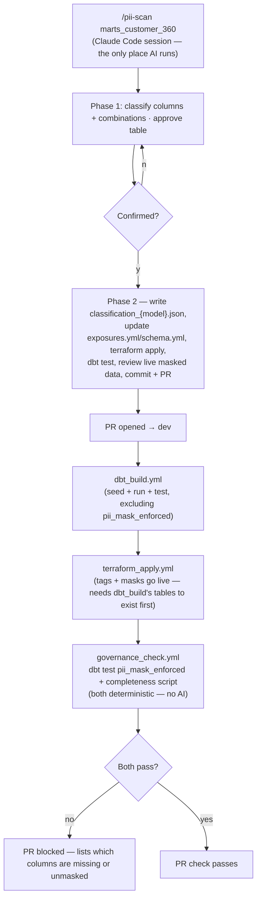
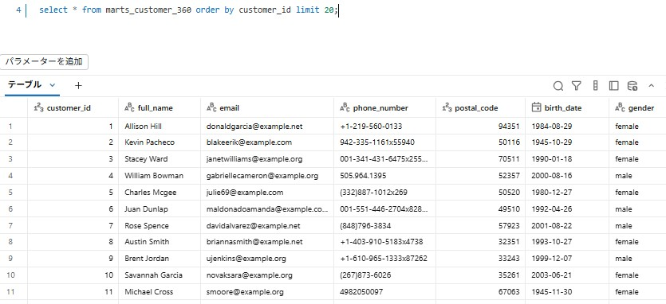
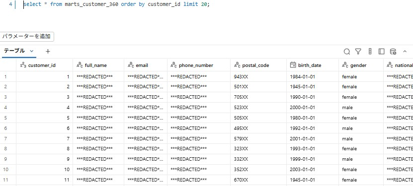
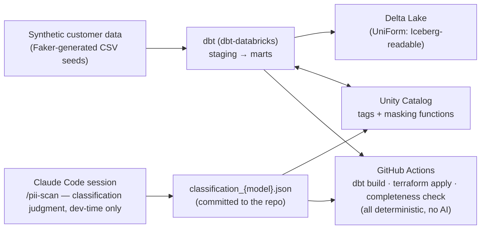
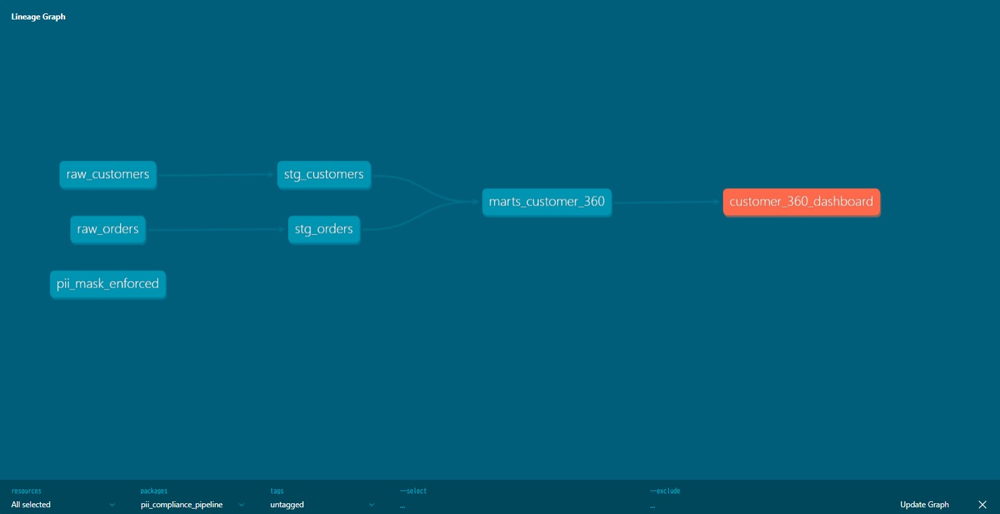

# dbt PII Compliance Pipeline

GDPR requires every organization to know which columns hold personal data and to protect them — but in practice, PII classification is still done by hand, drifts out of date as models change, and tools like Purview or Collibra are expensive and shallow (keyword matching on column names, no judgment on combined re-identification risk).

This project splits the problem into two halves that don't need the same tool: a developer-time Claude Code skill (`/pii-scan`) does the actual classification judgment — reading a dbt model's columns and sample data, classifying each one against GDPR categories including quasi-identifier *combinations*, not just single-column keyword matches — and CI/CD verifies, with plain deterministic checks, that the classification is complete and actually enforced. No AI runs anywhere in CI; there's nothing for an LLM to judge in "does this list contain that item" or "does this tag have a matching mask."

---

## Why This Exists

In a real data platform, new dbt models and columns appear constantly. The traditional approach to PII governance requires someone to:

1. Manually review every new/changed column for personal data
2. Decide whether it's PII on its own, or only risky in combination with other columns
3. Apply masking, keep documentation in sync, and hope nothing slips through before the next audit

This is exactly the kind of judgment-heavy, easy-to-forget work that causes real compliance incidents — not because anyone was careless, but because nothing forces the check at the moment a model changes.

**The goal**: classify PII risk (including multi-column re-identification risk) with AI assistance and human review at development time — both up front on raw sample data, and again afterward against the real masked output — then enforce and verify it continuously in CI with nothing but deterministic checks. The judgment calls happen once per change, inside `/pii-scan`, never in CI; checking that the judgment was actually applied and didn't drift is a separate, deterministic problem.

---

## How It Works

### The `/pii-scan` Command

Invoked inside a Claude Code session:

```
/pii-scan stg_customers
/pii-scan marts_customer_360
```

**Phase 1 — Classify** (no files touched): Claude reads the model's compiled columns plus a bounded data sample, classifies each column (not PII / direct identifier / GDPR Art. 9 special category / quasi-identifier), and checks column **combinations** for re-identification risk — e.g. `postal_code` + `birth_date` + `gender` is low-risk individually but identifying together. The full classification table is shown for approval before Phase 2 begins.

**Phase 2 — Execute**: Each of the 9 steps is shown as a diff with a `y/n` prompt. Nothing is written until confirmed. STEP 8/9 is the second and last place AI runs — after masks are live, it reviews a real sample of the masked table for residual risk metadata checks can't see.



Note the chain is **sequential**, not parallel-then-join: `terraform_apply` tags/masks a table that only `dbt_build` creates, so it can't run before — or alongside — `dbt_build`. Catalog creation isn't in this chain at all — it's bootstrapped once via `terraform_catalog_apply.yml` (`workflow_dispatch`, manual), since `dbt_build` itself can't run until the catalog already exists either.

### Auto-Generated PR

Claude creates the PR body automatically, summarizing the classification and every file touched. CI then re-checks that classification against live Databricks state with a plain script — no LLM call, just "does every column that exists today have an entry in the JSON."

### Masking in Action

Querying `marts_customer_360` directly in the Databricks SQL editor, before and after `/pii-scan` runs:

**Before** — raw values, fully visible:



**After** — `direct_identifier` columns (`full_name`, `email`, `phone_number`) fully redacted; `quasi_identifier` columns (`postal_code`, `birth_date`) generalized instead of redacted, so regional/age-cohort analysis still works on the masked data:



---

## Pipeline Architecture



The same dependency graph, as dbt's own `dbt docs` lineage view sees it (`raw_customers`/`raw_orders` → staging → `marts_customer_360` → the `customer_360_dashboard` exposure):



### Why synthetic data

All sample data is generated with `Faker` — this is a portfolio project, not a real customer dataset, so there is no real PII to protect in the first place. The point is to demonstrate the classification and enforcement *mechanism*, not to handle real personal data.

---

## Tech Stack

| Layer | Technology |
|---|---|
| Compute / platform | Databricks (Free Edition / trial workspace) |
| Governance | Unity Catalog (column tags, masking functions, row filters) |
| Storage format | Delta Lake with UniForm (Iceberg-readable) |
| Transformation | dbt Core + dbt-databricks |
| AI classification | Claude Code (`/pii-scan` custom command) — developer-time only, no Anthropic API usage anywhere in this repo |
| Synthetic data | Faker |
| Infrastructure | Terraform (Databricks provider) |
| CI/CD | GitHub Actions |

---

## Project Structure

```
.
├── dbt/
│   ├── dbt_project.yml
│   ├── models/
│   │   ├── staging/                   # raw seed → typed staging models
│   │   ├── marts/                     # public-facing / BI-exposed models
│   │   └── exposures.yml              # marks which models are public-facing
│   ├── seeds/                         # Faker-generated synthetic customer data
│   ├── tests/
│   │   └── pii_mask_enforced.sql      # singular test: cross-checks column_tags (mask_required) against column_masks for exposed models → fail on any gap
│   └── macros/
│       ├── create_catalog.sql         # idempotent CREATE CATALOG IF NOT EXISTS, run via dbt run-operation
│       └── drop_catalog.sql           # idempotent DROP CATALOG IF EXISTS ... CASCADE, for environment resets
├── src/
│   └── catalog/                       # classification_{model}.json (the classification result, committed) + apply_tags.py / apply_masks.py, both via Databricks SQL connector reusing dbt's profiles.yml
├── terraform/
│   ├── modules/databricks/
│   │   ├── catalog/                   # null_resource + local-exec → dbt run-operation create_catalog_if_not_exists (native databricks_catalog blocked by this workspace's storage config)
│   │   ├── unity_catalog_tags/        # native databricks_entity_tag_assignment, for_each over the classification JSON
│   │   └── masking_policies/          # null_resource + local-exec → src/catalog/apply_masks.py (no native mask resource exists)
│   └── env/
│       ├── catalog/                   # separate state — bootstrap only, applied manually/infrequently (see terraform_catalog_apply.yml)
│       └── dev/                        # unity_catalog_tags + masking_policies only — reconciled on every PR via ci.yml
├── tests/                             # Python unit tests for src/
├── scripts/
│   ├── generate_sample_data.py        # synthetic data generation
│   ├── check_classification_completeness.py  # deterministic CI check — no AI, just set comparison against live Databricks columns
│   └── sample_live_table.py           # plain fetch-and-print, used by /pii-scan STEP 8/9 — the judgment happens in the Claude Code session, not here
├── .github/workflows/
│   ├── ci.yml                         # pull_request trigger, chains the 3 reusable workflows below sequentially (needs:)
│   ├── dbt_build.yml                  # workflow_call — seed + run + test, excluding pii_mask_enforced
│   ├── terraform_apply.yml            # workflow_call — tags + masks go live (needs dbt_build's tables to exist)
│   ├── governance_check.yml           # workflow_call — dbt test pii_mask_enforced + check_classification_completeness.py (needs terraform_apply)
│   ├── terraform_catalog_apply.yml    # workflow_dispatch (manual only) — bootstrap, infrequent
│   └── terraform_catalog_destroy.yml  # workflow_dispatch (manual only) — DROP CATALOG ... CASCADE, environment teardown
└── .claude/commands/
    └── pii-scan.md                    # /pii-scan command definition — a developer-time skill, never invoked by CI
```

---

## Design Decisions

**Why confirmation at every step, not full automation?**
PII classification carries real legal and reputational risk if wrong. A fully automated approach removes the human judgment needed to catch context the model can't see — a column named `notes` containing addresses in free text, a quasi-identifier combination that's only risky given how a specific table is joined downstream. The interactive model keeps the engineer accountable while eliminating the mechanical work of tagging and test maintenance.

**Why check column combinations, not just single columns?**
Keyword-matching tools (the kind already on the market) catch `email` and `ssn` easily — that's not a differentiator. The actual hard problem in GDPR compliance is recognizing that columns which are individually harmless (`postal_code`, `birth_date`, `gender`) can re-identify someone in combination. That's the judgment a classifier needs to demonstrate to be worth anything.

**Why Unity Catalog tags + masking functions instead of a separate governance tool?**
Tags and column masks live next to the data itself and are enforced at query time regardless of which tool reads the table — no separate governance layer to keep in sync.

**Why a dbt test as the enforcement gate, not just a one-time scan?**
Models change constantly. A one-time classification goes stale the moment a column is added. A dbt test re-validates on every run, so drift is caught the same way a broken data contract would be.

**Why is there a separate `mask_required` tag instead of just checking `pii_category`?**
Early on, `pii_mask_enforced` checked any non-`not_pii` tag against active masks — and it correctly failed on `gender`, which is tagged `quasi_identifier` but deliberately left unmasked (masking `postal_code` + `birth_date` already breaks the re-identification combination; masking `gender` too would cost aggregate utility for no real risk reduction). The test had no way to distinguish "an intentional exception" from "an undetected gap" — both looked identical. `mask_required` (set alongside `pii_category` by the same tagging step) makes that judgment call an explicit, queryable fact in Unity Catalog instead of leaving it as an artifact of whatever the classification JSON happened to say.

**Doesn't CI need to re-run AI classification to catch a column someone forgot to classify?**
That was the original design — `pii_compliance_check.yml` called the Anthropic API directly to re-classify diffed models, on the theory that CI is unattended so it needs its own way to invoke Claude. That theory doesn't survive contact with what the check actually needs to catch: "did every column get a classification entry" is a set-membership question (is column X present in `classification_{model}.json`'s column list), not a question that requires re-judging *what* the classification should be. `scripts/check_classification_completeness.py` answers it with a live `information_schema.columns` query and a Python set difference — no API key, no billing, no LLM involved. The judgment call already happened once, when a human ran `/pii-scan` and reviewed the result; CI's job is checking that the judgment was actually recorded for everything that exists today, not re-deriving it.

**Why does `support_notes` get fully redacted instead of masking only the rows that actually contain PII?**
Free-text fields occasionally embed an address or phone number inline, but detecting that reliably on every row isn't achievable — there's no bright line that separates "safe" rows from "risky" ones at the column level. Rather than rely on imperfect per-row detection, the column is masked entirely by default. This is a deliberate, conservative trade against business utility — and the same logic would apply to any column where row-level detection is the better but unreachable goal.

**Is this system claiming to guarantee zero PII leaks?**
No — and it shouldn't claim that. GDPR's own standard (Art. 32) is "appropriate technical and organisational measures," a proportionality test, not a perfection test. This project automates the high-confidence, common cases and routes low-confidence ones through human review (the `confidence` field, the `/pii-scan` approval gate); it doesn't claim to catch every ambiguous or context-dependent case (e.g. personal disclosures buried in free text that don't match any known pattern). The realistic goal is reducing risk and creating an auditable process, not proving an unprovable negative.

**What did actually running `/pii-scan` end-to-end (not just each piece in isolation) catch?**
A real ordering bug: STEP 6/8 (`terraform apply`) failed with "Table ... does not exist" when run against a freshly-destroyed environment, because `unity_catalog_tags` and `masking_policies` tag/mask a table that dbt — not Terraform — creates. Each piece had been verified individually (classification, tagging, masking, the dbt test, Terraform applying cleanly) but never run as the single connected workflow `/pii-scan` actually is, so this dependency gap never surfaced. Fixed by documenting the prerequisite explicitly in STEP 6 (`dbt seed && dbt run` before `terraform apply` if the table's existence is unsure) rather than assuming the table is always already there.

**Why is the catalog Terraform config (`terraform/env/catalog/`) a separate state from tags/masks (`terraform/env/dev/`)?**
The dependency chain has an edge in both directions: `dbt seed`/`dbt run` can't write tables into a catalog that doesn't exist yet, and `unity_catalog_tags`/`masking_policies` can't tag/mask columns on tables `dbt` hasn't created yet. With all three Terraform modules in one state, there's no single ordering that works against `dbt_build` — catalog needs to come *before* it, tags/masks need to come *after* it. Splitting catalog into its own state (applied once, infrequently, via `terraform_catalog_apply.yml`) resolves this the way most real Databricks platforms already do it: catalog/schema provisioning is treated as rare bootstrap infrastructure, decoupled from the CI pipeline that runs on every PR, which can then simply assume the catalog already exists.

**Why Delta Lake with UniForm instead of native Iceberg?**
Unity Catalog's governance features (tags, masking, lineage) are native to Delta Lake. UniForm exposes the same tables as Iceberg-readable without giving up that governance layer — useful in a multi-engine context where non-Databricks engines need read access.

**`pii_mask_enforced.sql` already checks enforcement — why does `/pii-scan` also review live data in STEP 8/9?**
Because "a mask is attached" and "the masked output is actually safe" are different claims. `pii_mask_enforced.sql` is a metadata check: it joins `column_tags` against `column_masks` and fails if a `mask_required` column has no mask function attached. It cannot tell whether a generalized `postal_code` is still narrow enough to isolate one person in practice, whether a redaction silently misses a row, or whether a free-text column has accumulated a PII pattern since the last classification — all of these still look like "a mask is attached" to a metadata query. STEP 8/9 closes that gap the same way Phase 1 closes the keyword-matching gap: by having Claude actually look at real values (here, the live masked output via `scripts/sample_live_table.py`) instead of trusting that correct-looking metadata means a safe outcome. It's advisory, not a CI gate — the same reasoning that keeps AI out of CI applies here too: this is a judgment call, made once per change, inside the one interactive session, not something to re-run unattended.

**What did actually running STEP 8/9 against live masked data find — and was it acted on?**
Yes, and the finding is a real limitation of this portfolio's data scale, not a hypothetical. Sampling 100 live rows from `marts_customer_360` after masking showed every `direct_identifier` column correctly redacted with no gaps. But the `postal_code` + `birth_date` + `gender` quasi-identifier group still showed a problem: across the sample, no two rows shared the same (generalized `postal_code` prefix, birth year, `gender`) combination — meaning the generalization wasn't actually collapsing rows together. With ~500 synthetic customers spread across roughly 1,000 possible postal prefixes × ~70 birth years × 2 genders, the bucket space is far larger than the population, so k-anonymity (k≥2) isn't achieved for most rows even after masking — a column-by-column metadata check (`pii_mask_enforced.sql`) can't see this; it only confirms a mask function is attached, not that the chosen generalization actually achieves anonymity at this population size.

This was accepted as a known artifact of synthetic dataset size rather than fed back into STEP 2 to widen the generalization (e.g. 2-digit postal prefix, 5-year birth buckets): at real production scale — thousands of customers per postal prefix instead of roughly one — the same generalization would collapse rows into meaningfully sized groups. Coarsening it further here would mask the actual trade-off (`mask_strategy` granularity vs. dataset size) that STEP 8/9 exists to surface, rather than fix it. The honest takeaway is that STEP 8/9's value isn't "always passes clean" — it's catching exactly this kind of gap that a metadata check structurally cannot, and giving a human the choice to revise or accept it with the reasoning on record.

**Why does Terraform call Python scripts instead of using native resources — and is that true for all three modules?**
No — this needed checking per-resource rather than assuming, and the answer differs by module (verified against the [provider source](https://github.com/databricks/terraform-provider-databricks/tree/main/docs/resources), not assumed):

- **Catalog**: `databricks_catalog` *does* exist natively, but failed against this specific Databricks Free Edition workspace with "Metastore storage root URL does not exist" — it expects an explicit managed storage location that isn't worth provisioning for a portfolio dev catalog. This is a workspace/tier limitation, not a missing-resource problem. `CREATE CATALOG IF NOT EXISTS` via SQL works fine against this workspace's default storage, so the catalog module delegates to the same dbt macro `/pii-scan` would use.
- **Tags**: `databricks_entity_tag_assignment` *does* exist and supports `entity_type = "columns"` — there was no real justification for a `null_resource` + `local-exec` wrapper here, so this module was migrated to the native resource: the classification JSON is read directly via `jsondecode(file(...))` and `for_each` over it, one `databricks_entity_tag_assignment` per column per tag key (`pii_category`, `mask_required`). `terraform plan` shows real attribute-level diffs (`tag_value = "direct_identifier"`) instead of an opaque trigger hash.
- **Masking functions / `SET MASK`**: confirmed no native resource exists (no `mask`-named resource in the provider, and `databricks_sql_table`'s `column` block has no masking attribute) — `null_resource` + `local-exec` calling `apply_masks.py` is the only option here.
